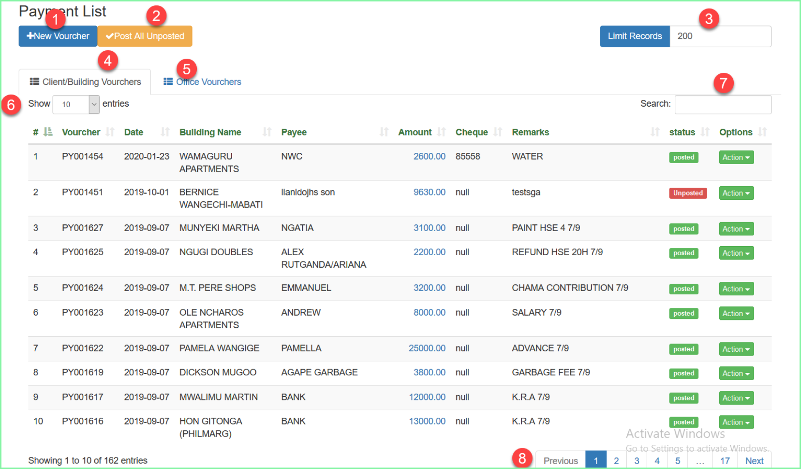

Right under the receipting option is the payments menu option under which the tab allows for recording of voucher payments paid out on behalf of the Landlords account or the Office account.

An open payments list tab shown below also has some controls to go with it like other tabs:

//payments tab list image

**1. New Voucher**: Open a capture payment voucher mini-tab.
**2. Post All Unposted**: Post all captured vouchers.
**3. Limit Records**: Limit the no of payments to show.
**4. Client/Building Vouchers**: List of payment vouchers of client accounts.
**5. Office Vouchers**: List of payments vouchers of office account.
**6. Show Entries**: Vary number to display at a go.
**7. Search**: Filter Receipt List with certain keywords.
**8. Pages Count**: Show number of pages of the results

The New Voucher button (1) above prompts the tab below, where by clicking the indicated Add New Row button, a row of expenses with their indicated Remarks and Amounts can be added to tally the total expense amount payable.

This is after the capture of the other details such as Payee, Account, Payment Type and Building for Client Voucher Payments.

//new voucher creaion tab image here

After clicking the save/post button the payment voucher is saved to the payment list awaiting approval from the authorized user.

In addition to approval, the payment vouchers can also be reversed if the details captured are incorrect, the payment itself has to be refunded or any company policy that may necessitate a reverse.

The extent of use for the credit notes should be guided by the company policy which **`REAMSPRO`** helps management implement and enforce to drive transparency within the operations.

