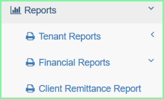
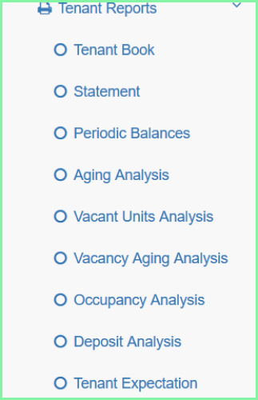
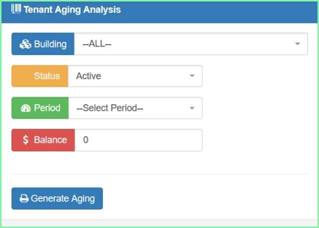
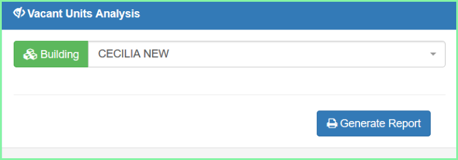
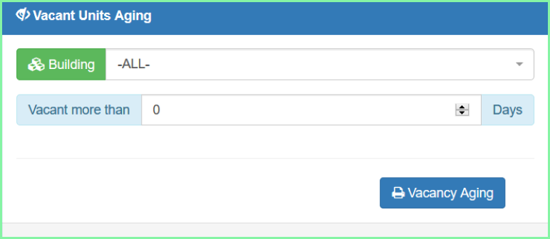
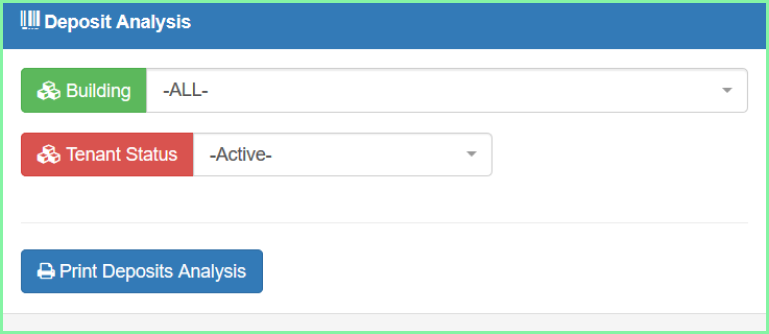
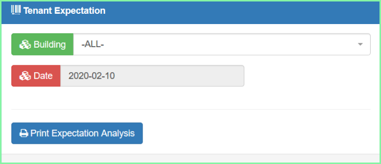

The reporting function of REAMSPRO allows for the presentation of data in an organized format for users seeking some specific information. 

The reports are divided into three main categories:

1. Tenant reports.
These are reports presenting information relating to all tenant and unit accounts.

2. Financial reports.
These are reports that present the user with information dealing with transactions recorded in the tenant and landlord accounts.

3. Client Remittance Report
This is a report generated from the client/landlord’s account bringing together all the tenant transactions in their respective property.

//reports sub-menu image

----

## Tenant reports.

The tenant reports are further divided into different categories which are displayed to the user upon clicking the tenant reports menu namely:

//tenant report sub-menu image here

## Tenant Book

This is a report of all the tenants, property and unit occupied, their rent and utility amounts and phone numbers.
It presents an overview of all the tenants captured in the system.

### Tenant Statement

The tenant statement sets out the debit and credit items between the management company and the tenant.

### Periodic Balances
   
The periodic balances report is generated and classified as per the managers and the properties under their management with the tenant’s balances displayed.
Property managers can select one or all of their properties and print out the report to use during their field-work.

//periodic balances dialog image here

### Aging Analysis
   
The aging analysis report presents the user with an overview of tenants either within one particular property or across all the properties with their balances presented in according to some timelines.
These timelines show how long the tenant has had the balance for, the user can choose between the different timelines available at the report dialogue and also the specific balance amount range.

//tenant analysis report dialog and print out here

### Vacant Units Analysis

This analysis presents to a property manager all the units in a given property that are unoccupied.
The report can also be for all units vacant across the properties.
The report also shows the last tenant in the particular unit and the rent the tenant paid during period of occupation.

//vacant unit dialog and print out image here

### Vacancy Aging Analysis
   
This analysis presents the vacant units as per their vacancy period, the last tenant and the date vacated.
Across one particular property or all of them, this report shows the number of days units have been vacant.

This report can be printed out or sent via email for use by landlord or field officer.

//vacant unit dialog and report image here

### Occupancy Analysis

This report presents the expected rent from the total units and the collectable units from occupied units with a percentage of the occupancy.

//occupancy dialog and report image here

### Deposit Analysis

This is a report of all the deposits due to the tenants as per property and how much they have utilized if at all.

It also shows the resulting refundable amounts after the deductions from the initial deposit amount.

//deposit dialog and report image here

### Tenant Expectation
    
This report takes into account the payment history of the tenants in the building selection and using that data projects the expected payment as per a given date in that particular month.

//expectation dialog and report image

