The settings side menu is found on the menu right under the Dashboard option and has under it quite a few important controls as shown below.

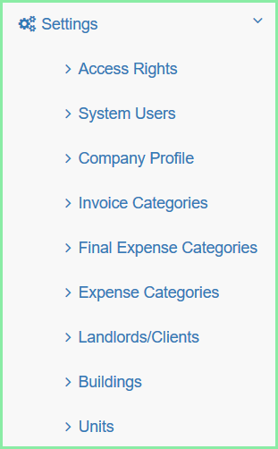

The settings menu comes with it:

+ **1. Access Rights**: Holds all the user rights controls.
+ **2. System Users**: Displays a list of all system users.
+ **3. Company Profile**: Allows creation of company profile.
+ **4. Invoice Categories**: Allows creation of invoice types.
+ **5. Final Expense Categories**: Creation of invoices for final expense receipting.
+ **6. Expense Categories**: Creation of payment expenses.
+ **7. Landlords/Clients**: Allows capture and management of landlord details.
+ **8. Building**: Allows capture and management of building details.
+ **9. Units**: Allows creation and management of units.

----

## Access Rights

For every user group there is a bundle of rights allowed to them by the system as per the administrator’s allowance. They can either be add, edit, delete, reverse, or print rights.

User groups include but are not limited to Administrators, Accountants, Cashier, Managers and Field Officers.

Below are some open tabs of Access Rights:

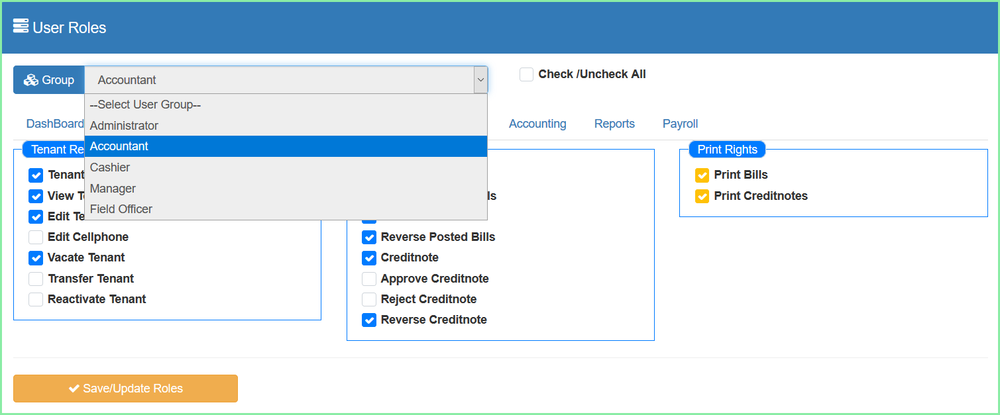

----

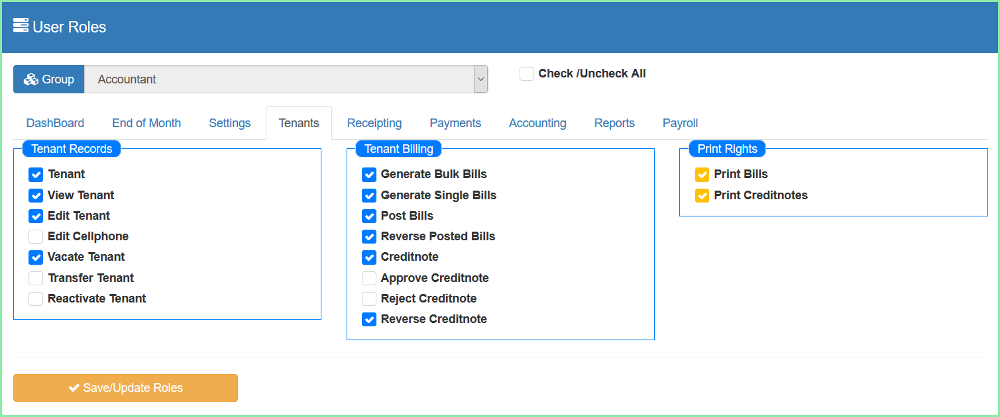

----

## `System Users`

This tab allows for the creation and management of system users. 

This is an administrative task carried out by the system administrator.

Name, Email, Group, Status, Password are among the details that need to be captured by the admin when registering new users to the system.

The password should be ‘strong’ enough but also easy enough for the user to remember.

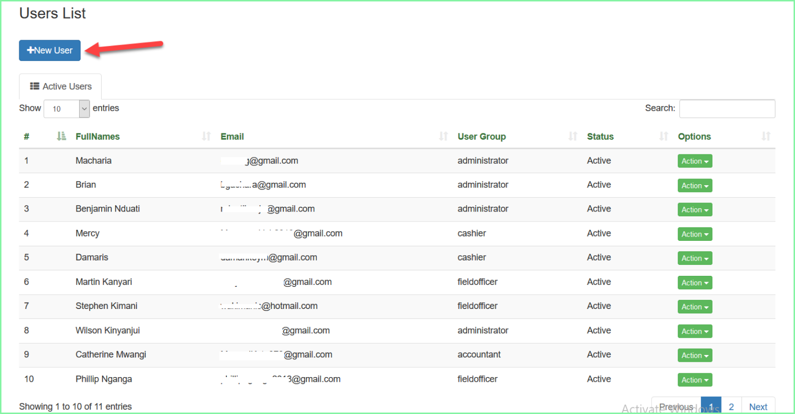

----

## `Company Profile`

In the Company Profile tab, the system admin creates and stores the company profile by clicking on the indicated button and entering the required details. 

This company profile helps customize the invoices, payments and receipts printed from the system.

----

## `Invoice categories`

For every payment receipted from the tenants, there are particular invoices that it seeks to clear. 
The invoice categories tab allows for creation of the different invoice types.

The number and type of invoice categories depends on company policy and can be as many and varying as possible and are added by clicking on the Add New Category as shown below:

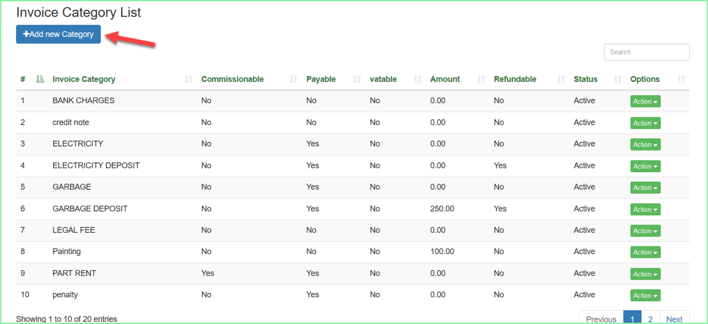

The invoices themselves have certain properties that should be set on creation to control the recording and allocation of payments for accounting purposes, whether they are commissionable, payable, vatable, refundable and their status as shown below:

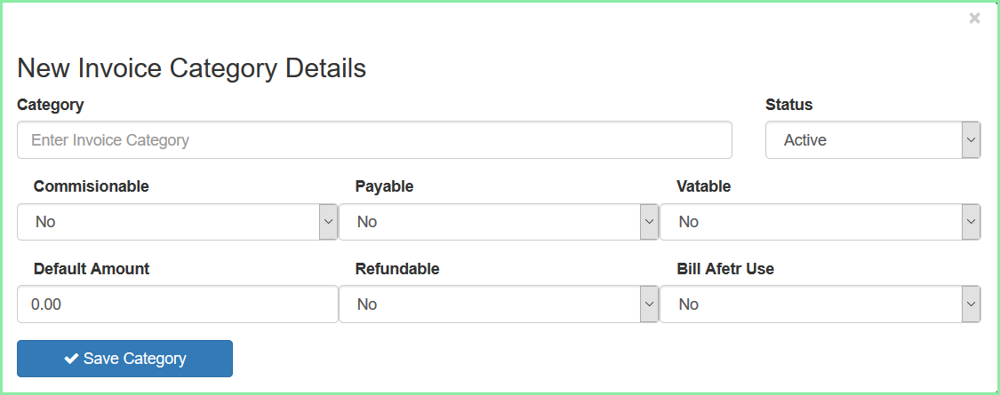

----

## `Final Expense Categories`

Invoices specific to tenant vacation payments are created from here and like the normal invoices can be as many and varying as needed or specified by the company via its policies.

// final expense pic here.

The details needed to capture the specific final expense are few but equally important as all others.
A list of expense categories to be used appears in the Final Expense tab as shown below:

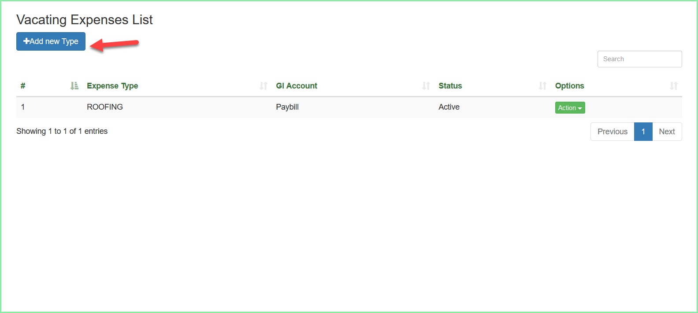

----

## `Expense Categories`

Expense type specific to a landlord’s property or the office are created and managed from the Expense Categories tab.  
The Add New Category button allows for creation of new expense categories after filling the expense type in expense details window.

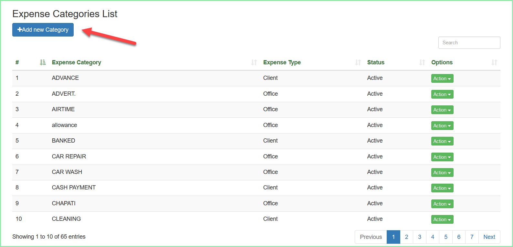

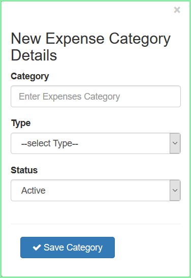

----

## `Landlords/Clients`

With respect to the buildings under management, a property management company has to keep records of the landlord’s details.
The landlord’s name, identification number, cellphone and email are some of the details captured as shown below upon clicking button (1).

On capture of details, each landlord gets their own unique File No# which is associated with their details and property/s, this aids in easier reference for the system and also its users.

On deactivation of landlord accounts, their details and info are saved in the Inactive details tab indicated (2) below.
The search option indicated (3) below helps when sifting via the landlords list with keywords.

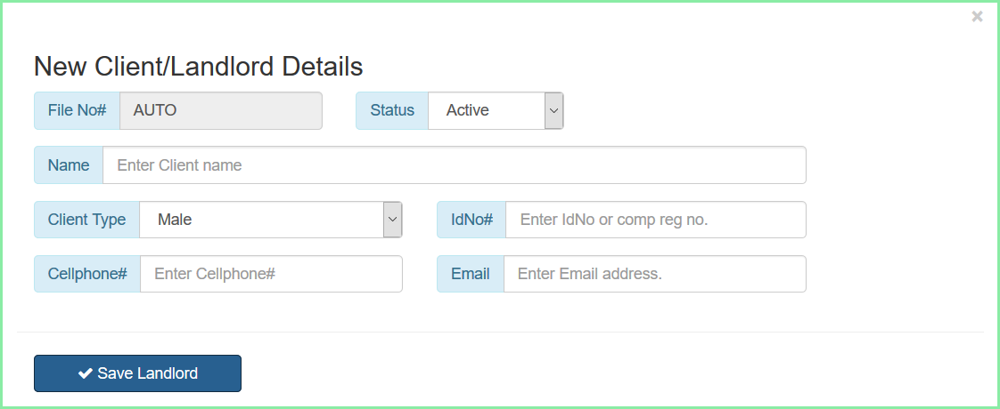

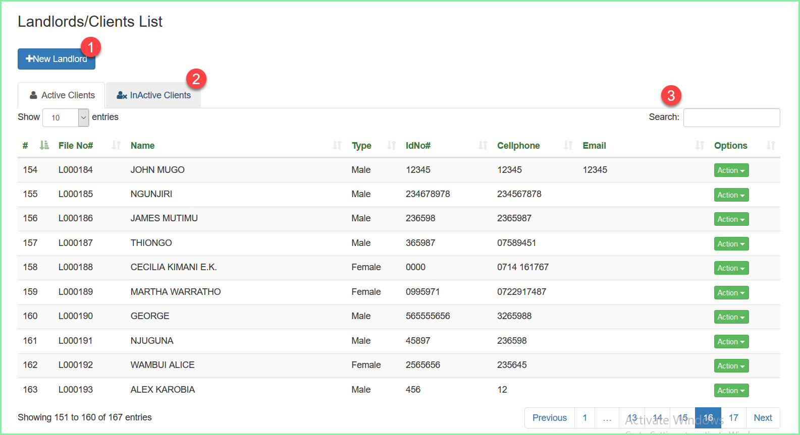

----

## `Building`

After registration of the landlords into the system, the next step is to register their properties under management.
Buildings too have certain details unique to them that you need to capture when registering to aid in management and monitoring.

The default building tab displays the list of building under management with some of their details.

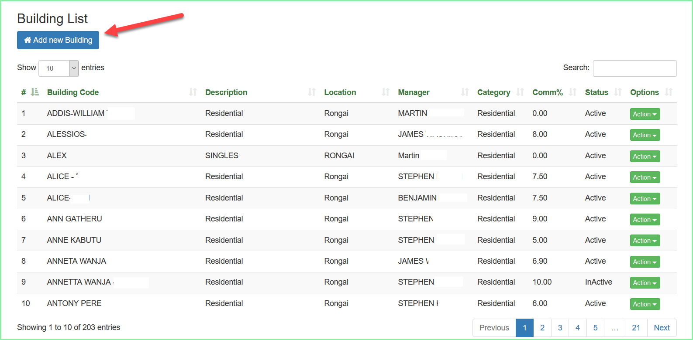

On clicking the Add New Building shown above a details tab is displayed where all the details adding to the building’s uniqueness are captured like the one below.

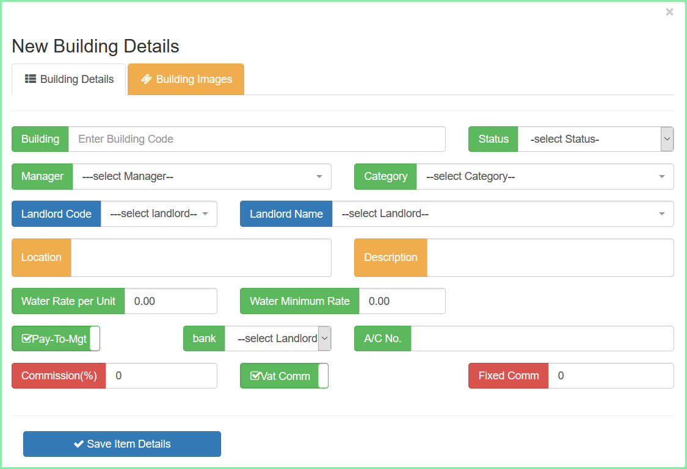

The building name, category which is either residential or commercial and the respective landlord are among the key details to capture.

Additional details to be captured are commission due either fixed or percentage, whether tenants make payment to management company or landlords account and accompanying bank details, its location and a brief description of the property, and also water unit rates for that particular property.

----

## `Units`

After the registration of landlords and their respective properties, we generate the units to the properties to allow capturing of tenants in the properties.

In this step we generate the units of the particular property as they are physically on site. Units naming can either be numeric, alphabet or even alphanumeric which the system is primed to capture.

There is no limit to the number of units that can be generated to accommodate the tenants in a property.

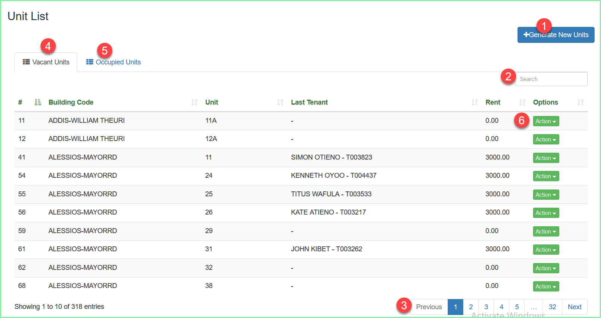

The Unit List tab also comes with navigation cues namely:

+ **1. Generate New Units**: The generate unit prompt is displayed on clicking.
+ **2. Search Field**: Allows filter of search results with custom key words.
+ **3. Page Count**: Shows the number of pages of the results.
+ **4. Vacant Units**: Shows the list of vacant units across the properties.
+ **5. Occupied Units**: Shows the list of occupied units across the properties.
+ **6. Action button**: Allows the remove/delete option of the unit list.

On clicking the Generate New Units button, a prompt to generate units is displayed.

The prompt shown below upon selection of a building, and a start and end unit number and also a prefix and suffix when needed generates the units requested.

>The prefix and suffix are mostly alphabets.

// unit creation dialog image here.

You can only generate the units per one property to ensure no overlap between different properties.
Unit naming on one property does not affect the naming of units in other properties, so units can have the same names across many properties.
