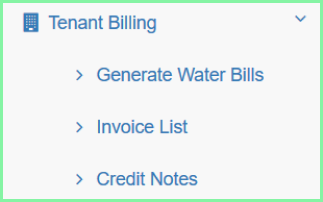
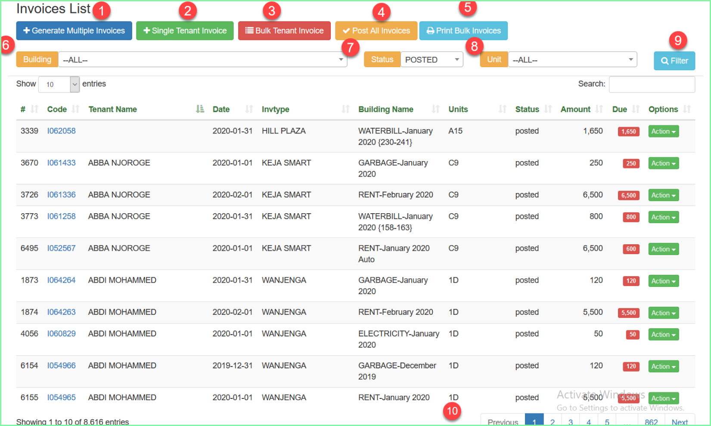
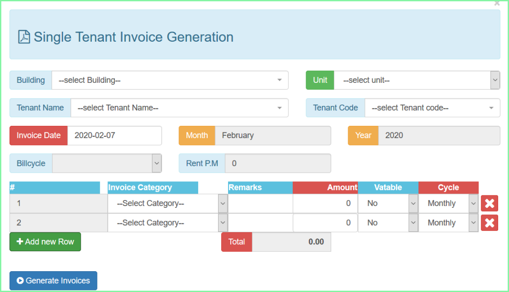
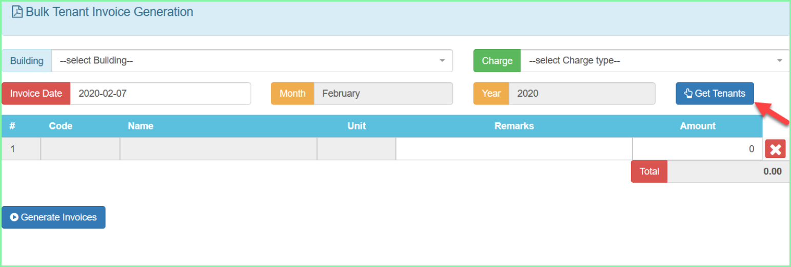
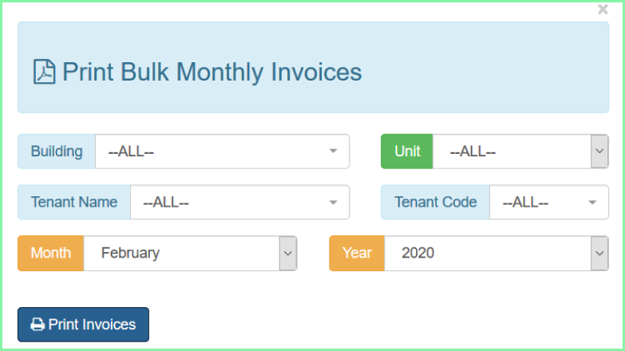
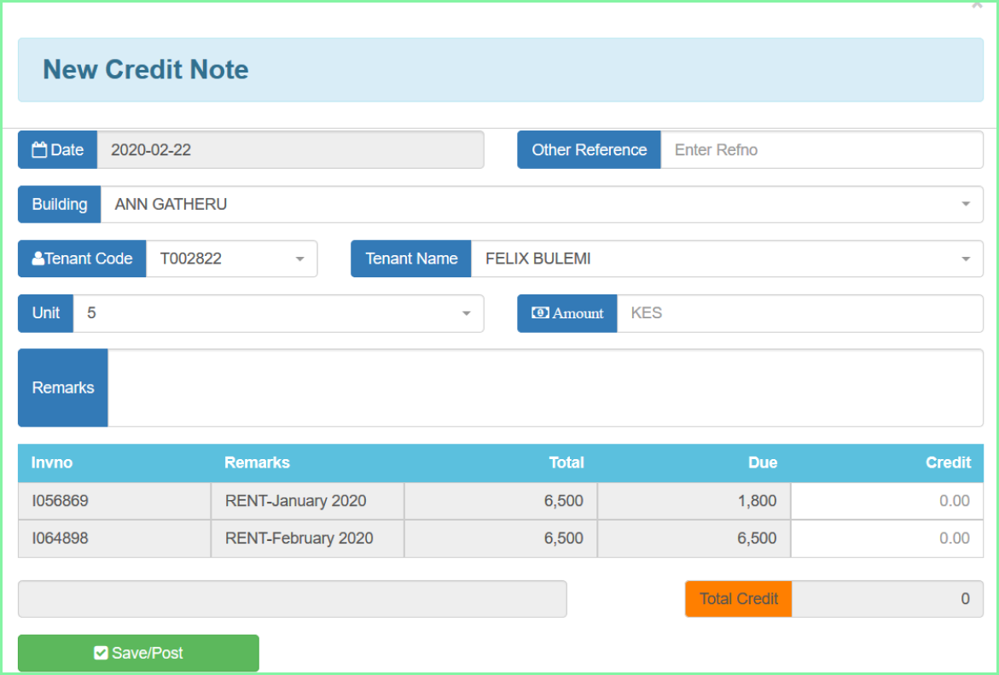

One of the main stages in the tenancy lifecycle is tenant billing, this involves the identification and generation of due charges to the tenants as per their resource consumption.

In addition to rent, other invoice types you can generate and bill include: water bills, security, garbage, and service charge.

Through this menu you can:

+ **1. Generate Water Bills**
+ **2. Generate Invoices**
+ **3. Raise Credit Notes**

----

## `Generate Water Bills`

This tab allows for input of water unit per building/property and outputs the correct amount due from the set building unit rate.

On clicking the New Readings button, the entry tab is brought up.

The capture readings tab, upon selection of building and confirmation of bill date, generates an entry sheet in excel format(1) where the user inputs the new unit readings and uploads them back into the system using the Upload Readings button(2) then finally moves them to the invoicing using the Migrate Readings to Bills(3) button.

A record of all the water unit readings captured is stored in the system as per the building and date of capture and billing and can be retrieved at any moment by a user.

----
## `Invoice List`

The invoice list tab is the bills generation point for all charges due to the tenant.

On the Invoices List tab above controls labelled 1-10 allow:

+ **1. Generation of multiple and varying invoices as per their property and dates.**
+ **2. Generation of invoices due to a single tenant.**
+ **3. Generation of bulk invoices of the same building and type.**
+ **4. Posting of invoices after generation.**
+ **5. Printing of all the invoices that are due to a particular building.**
+ **6. Selection of building that you would like results of filter to be from.**
+ **7. Selection of the status of the invoices to be within results.**
+ **8. Selection of the specific unit results from filter should be from.**
+ **9. The filter button that sorts data available by parameters set by unit.**
+ **10. The number of pages the results of filter occupy.**
+ **11. The search function window for filtering the results further by specific keywords.**

Authorized users can generate the bills either one at a time or in bulk, at any period during the billable month period and of any type all in-line with the company policy.
The invoices generated are dependent on the presets in the tenant details set during tenant registration and have to be posted after generation.

The following are open pop ups of all the above operations,

//multiple invoice dialog generation here.

In periodic you can select all the buildings and invoices at once then click the Generate Invoices button or select one property and invoice type and generate their invoices. The invoices date automatically update with billing periods.

Single tenant invoices are generated from here after capture of the prompted details and input of as many invoices as due to the tenant.
After generation invoices from both controls are listed as unposted in the list tab. 

Clicking the Get Tenants indicated above after selection of the building and charge type in above tab lists all the tenants of that particular property and their charge amounts for skimming to ensure consistency before generation.

These invoices too are listed in the invoice list tab as unposted and all can be transferred into their respective tenant accounts by clicking on the post all button hence posting them all.

If there need for physical invoices, the print bulk control allows it after selection of the specific details. Only generated and posted invoices can be printed.

----

## `Credit Notes`

The credit note list tab displays all the credit notes created for different tenants in the system with their accompanying details.

Clicking New Credit Note button indicated brings the creation pop up window.

The user has to select the building and the particular tenant whose account they want to credit as shown in the next figure.

The amount field holds the credit amount while the remarks allows input of additional information about the particular credit note transaction.

The credit amount should not be more than the total amount due from the tenant.
The save/post button saves the credit note to the credit note list with all its details waiting approval from the authorized user.
