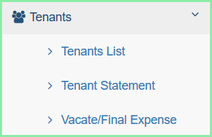
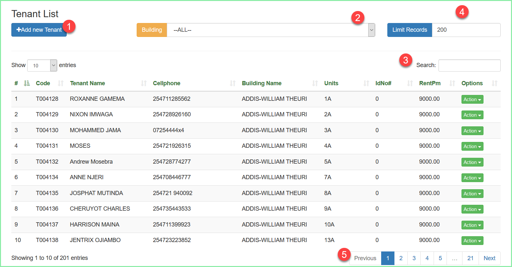
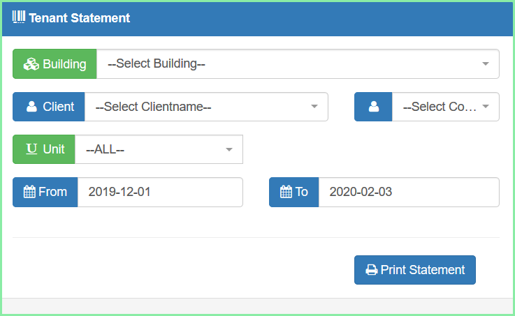
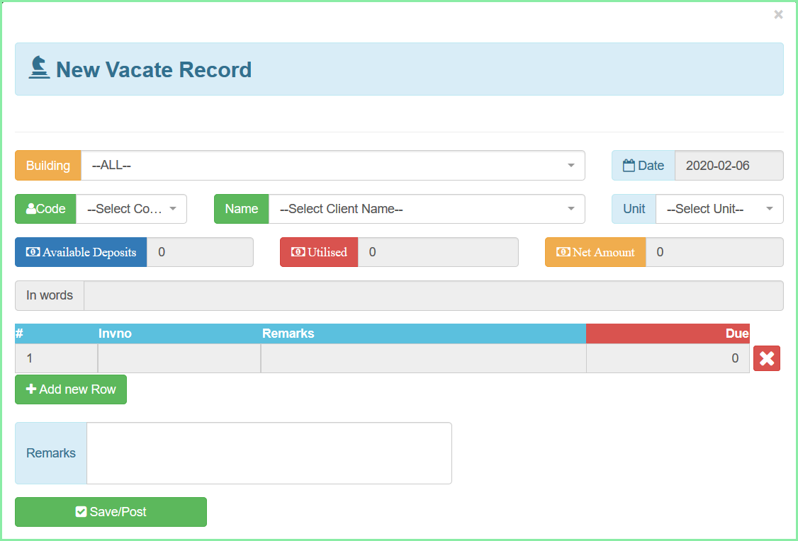
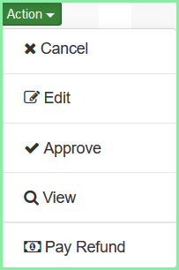

The management and administration of tenants within the system takes place in the tenants option found under the communication option on the menu.

Under it are three more sub-menus namely Tenant List, Tenant Statement and Vacate/Final Expense.

----

## Tenants list

The tenants  list tab displays the number and details of tenants in the properties under management.
The format of display allows for easy skimming over all tenants and either generally or through specific parameters of interest like property or rent amount

As indicated above the tab has some controls for easier navigation and use to it, which include:

1. Add New Tenant: On clicking it opens the New Tenant capture tab.
2. Building: Allows searching list via building.
3. Search: Customizes search results via keywords.
4. Limit Records: Varys the breadth of searching terms.
5. Page Count: Shows the page count of returned results.

On clicking the Add New Tenant button another tab opens as shown below where now all the main details of the tenant are captured into the system.
The tenant codes given to each tenant in the system are auto generated and also unique hence used for reference during storage of records.

Among the details captured during registration of tenants are bill cycle of the tenant, escalation days and rates, penalty days and rates too and some additional notes specific to that tenant.

//new tenant dialog image here.

The next step allows you to specify the unit of occupation with the accompanying charge types and amount, whether the charges are vatable, refundable, recurring while also indicating their bill dates.

//new tenant unit image here

The tenant record is safely stored after successful tenant detail data capture and can be retrieved for viewing and/or updating at the user’s convenience.

Perfect tenant record management is one of the key functions of a property manager that **`REAMSPRO`** looks to make easier to perform.

----

## Tenant Statement

Consistent tenant record management allows for accurate buildup of the tenant statement with all the details and specifics corresponding with their timelines.
The tenant statement can be retrieved anytime in the tenant’s lifecycle via the dialog shown below and later printed or send to the tenant via email.

----

## Vacate/Final Expense

//vacate dialog image here

One of the final tenant operations before vacating the tenant is calculating their final expense to the unit of occupation in regards to repairs.
Clicking the Add New Vacate Record shown above prompts a vacating record dialog into which the details of the vacating tenant are captured.
The final expenses are also filled into the pop-up, they can be as many and different as the tenant has been found to incur. 
The deposit is indicated right above the list of vacate expenses to help in easier calculation of refund or any amounts due from the tenant.
1 and 2 indicate the different viewing tab switches, Unapproved Vacate Record lists the tenants waiting approval for vacation from higher level users while Vacated Tenants indicate the already approved vacated tenants.

//new vacate record dialog image here

At the right end of the unapproved vacating record there is an action button which allows for more operations to be done on the record as shown:

//action sub-menu dialog image here.

The operations include cancelling, editing, approving, viewing and/or also Pay the refund due to the tenant.
All these controls are aimed at helping the management ensure the right funds are due to the right tenants in the best possible time.
